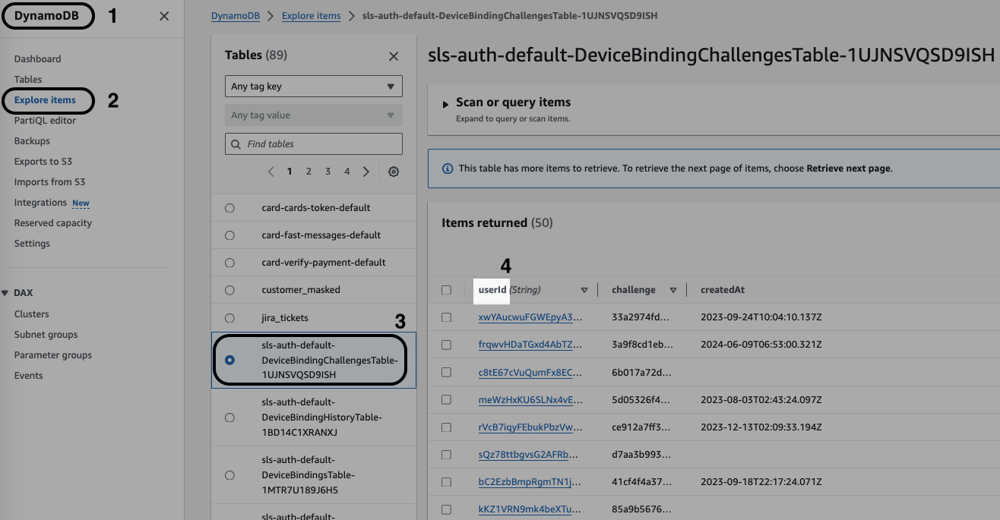

# Manual Backfill Glue Function
## Summary
This AWS Glue function is designed to backfill data from a DynamoDB table into an S3 bucket as Parquet files.
The function scans the DynamoDB table >> processes the data into a Pandas DataFrame >> uploads the processed data to S3.
The function allows for the specification of a start date to filter the records based on the updatedAt timestamp, and it supports different modes for writing data to S3.

## Key Features
- `Data Backfill`: Scans DynamoDB and uploads data to S3 as Parquet files.
- `Schema Management`: Applies Athena-compatible schemas to the data.
- `Flexible Configuration`: Supports different write modes and optional filtering by date.

## Sample Arguments
Before triggering the Glue function, provide a specific arguments in the following format:
```
    "RESULT_ATHENA_TABLE": "dynamo_sls_ias_recurring",
    "TARGET_DYNAMO_TABLE": "sls-ddb-scheduled-transfers-engine-recurring-rules",
    "DYNAMO_PRTITION_COLUMN": "customerId",
    "WRANGLER_WRITE_MODE": "append",
    "START_DATE": "15-01-2024",
    "INCREMENTAL_MODE": "False",
```

## Parameters (Be Careful with WRANGLER_WRITE_MODE)

- ### `RESULT_ATHENA_TABLE`:
Name of the Athena table where the data will be stored.

- ### `WRANGLER_WRITE_MODE`:
Mode of writing data to S3. Can be `append` or `overwrite_partitions`.
<br/>Note: It takes effect only on the first iteration/page of data, for next pages it is always `append`.
<br/>Note: Not allowed to use `overwrite mode`.

- ### `START_DATE` (optional):
Date to filter records based on the updatedAt timestamp. Format: dd-mm-yyyy.

- ### `TARGET_DYNAMO_TABLE`:
Name of the DynamoDB table to be scanned.

- ### `INCREMENTAL_MODE`:
A boolean that decide how to scan and save data, if:<br>
`True`: Each scanned page will be saved to s3 before paginating to the next one. Pros: Low memory usage. Cons: Risk of changed schema in next pages.<br>
`False`: Scan and append all pages into a single dataframe then save the bulk table to s3. Pros: Accurate schema detection. Cons: Risk of OOM errors.<br>

- ### `DYNAMO_PRTITION_COLUMN` (case sensitive):
From AWS console > DynamoDB > Explore items > select your table > copy the name of the first column
<br/>ex. `id`, `key`, `pk`, `userId`, `customerId`, `endpoint`, `name`, etc.
<br/><br/>
