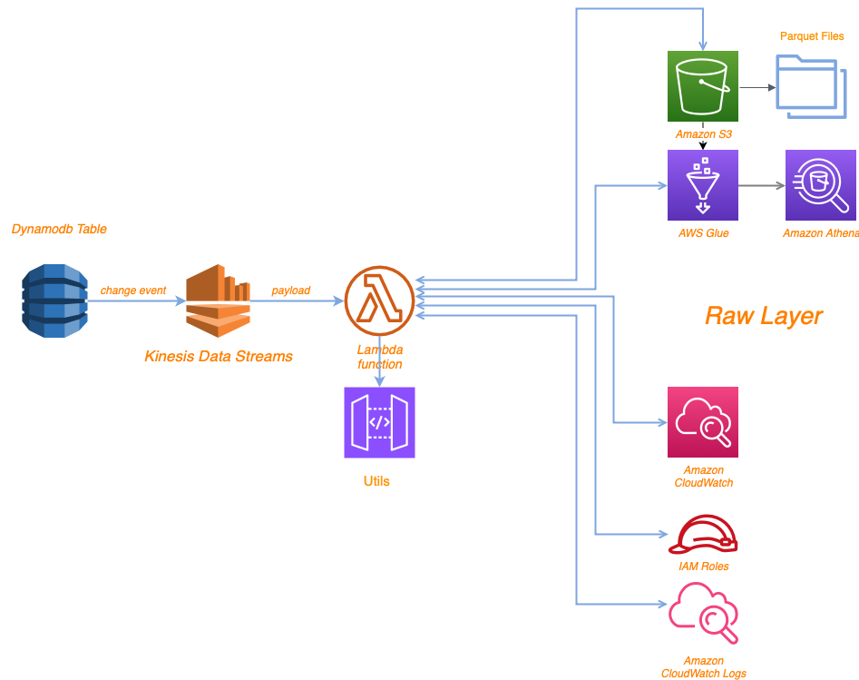

## Overview

This Lambda function is designed to handle multiple Kinesis Data Streams connected to various DynamoDB tables. It processes incoming records, flattens the JSON payload, applies the appropriate schema based on the source DynamoDB table, and writes the data to an S3 bucket in Parquet format. The data is partitioned and can be queried using Amazon Athena.

---

## Functionality

1. **Event Parsing**: 
   - The function processes Kinesis stream events, decodes the base64-encoded payload, and flattens the JSON structure.
   - Empty child elements (`{}` or `[]`) are replaced with `null`.

2. **Dynamic Table Mapping**: 
   - The function extracts the source DynamoDB table name from the event and maps it to the corresponding Athena table using a predefined mapping (TABLE_MAPPING).

3. **Schema Inference**:
   - The function infers the schema based on column names and DynamoDB data types.
   - Columns are cast to appropriate data types (e.g., `int`, `float`, `boolean`, `timestamp`, `date`, `string`).

4. **Data Writing**:
   - The processed data is written to an S3 bucket in Parquet format using AWS Data Wrangler (`awswrangler`).
   - The data is partitioned by date for efficient querying in Athena.
   - Schema evolution is supported, allowing new columns to be added dynamically.

6. **Logging**:
   - Detailed logging is provided for debugging and monitoring purposes.

---
## Mapping
```python
Dynamodb_Table_Mapping = {
    "dynamo_sls_referral": "sls-ddb-notifications-referral",
    "dynamo_sls_referral_code": "sls-ddb-notifications-referral-code",
    "dynamo_sls_ddb_customer_credentials_change_history": "sls-ddb-auth-customer-credentials-change-history",
    "dynamo_sls_ddb_customer_verification_attempt": "sls-ddb-auth-customer-verification-attempt",
    "dynamo_sls_ddb_customer_block_list": "sls-ddb-auth-customer-block-list",
    "dynamo_sls_riskscore": "sls-ddb-customer-risk-score",
    "dynamo_sls_risk_crm_case": "sls-ddb-customer-risk-crm-case",
    "dynamo_default_payment_products": "sls-payments-default-PaymentProductsTable-UQ42NN4TVLIO",
    "dynamo_sls_home_financing_mortgage_in_principle": "sls-ddb-home-financing-mortgage-in-principle",
    "dynamo_default_investment_user": "sls-ddb-investments-user",
    "dynamo_default_investment_sell": "sls-ddb-investments-sell",
    "dynamo_default_investment_fund": "sls-ddb-investments-fund",
    "dynamo_sls_home_financing_mortgage": "sls-ddb-home-financing-mortgage",
    "dynamo_sls_exchange_rates": "sls-ddb-exchange-rates-exchange-rates",
    "dynamo_sls_customer_risk_us_person": "sls-ddb-customer-risk-us-person",
    "dynamo_sls_ddb_users_customer_passport_number": "sls-ddb-users-customer-passport-number",
    "dynamo_scv_sls_customers": "sls-users-default-CustomersTable-VTNE66RA7M74",
    "dynamo_scv_sls_customer_temp": "sls-users-default-CustomersTable-13I9HDOH7PM38",
    "dynamo_sls_customer_identity": "sls-ddb-customer-identity-identity",
    "dynamo_sls_passcoderesetcodechallenges": "sls-ddb-customer-profile-orchestration-passcode-reset-code-challenges",
    "dynamo_sls_ddb_customer_address_verification_code": "sls-ddb-customer-address-verification-code",
    "dynamo_sls_payees_v2": "sls-ddb-payees-payees-v2",
    "dynamo_sls_cardorders": "sls-cards-default-CardOrdersTable-1MQQLGZA134UN",
    "dynamo_sls_document_verification": "sls-ddb-document-verification-document-verification",
    "dynamo_sls_ias_recurring": "sls-ddb-scheduled-transfers-engine-recurring-rules",
    "dynamo_sls_customer_risk_country_score": "sls-ddb-customer-risk-country-score",
    "dynamo_sls_customer_address_address": "sls-address-default-AddressTable-1FTG14N0KA1BW",
    "dynamo_sls_customer_finances": "sls-ddb-customer-finances",
    "dynamo_onfido": "sls-users-default-OnfidoTable-14XJN4659SX9V",
    "dynamo_sls_customer_risk_form": "sls-ddb-customer-risk-form-data",
    "dynamo_sls_passcoderesettiershistory": "sls-ddb-customer-profile-orchestration-passcode-reset-tiers-history",
    "dynamo_sls_cards": "sls-cards-default-CardsTable-6I28PLW23978",
    "dynamo_sls_clearbank_transactions": "sls-clearbank-default-ClearBankTransactions-8XH8FVUOYB9O",
    "dynamo_sls_confirmation_of_payee": "sls-ddb-confirmation-of-payee-logs",
    "dynamo_sls_cards_status_history": "sls-ddb-cards-cards-status-history",
    "dynamo_sls_home_financing_mortgage_application": "sls-ddb-home-financing-mortgage-application",
    "dynamo_card_fast_messages_default": "card-fast-messages-default",
    "dynamo_sls_riskscore_history": "sls-ddb-customer-risk-score-history",
    "dynamo_sls_cards_rules": "sls-ddb-cards-card-rules",
    "dynamo_sls_cards_disabled_rules_history": "sls-ddb-cards-card-disabled-rules-history",
    "dynamo_sls_investments_model_portfolio": "sls-ddb-investments-model-portfolio",
    "dynamo_sls_investments_model_portfolio_rebalance": "sls-ddb-investments-model-portfolio-rebalance",
    "dynamo_sls_investments_instrument": "sls-ddb-investments-instrument",
    "dynamo_sls_investments_dividend": "sls-ddb-investments-dividend",
    "dynamo_sls_investments_daily_fees": "sls-ddb-investments-daily-fees",
    "dynamo_sls_investments_monthly_fees": "sls-ddb-investments-monthly-fees",
    "dynamo_sls_investments_order": "sls-ddb-investments-order",
    "dynamo_sls_instant_savings_accounts_products": "sls-ddb-instant-savings-accounts-products",
}
```


--
## Diagram



## Dependencies

The Lambda function relies on the following Python libraries:
- `awswrangler`: For writing data to S3 in Parquet format.
- `boto3`: For interacting with AWS services (e.g., S3).
- `pandas`: For data manipulation and transformation.
- `flatten_json`: For flattening nested JSON structures.
- `data_catalog`: Custom module presumably containing schema definitions, column comments, and partition keys
- `utils`: custom module for additional data processing functions

## File Structure
    .
    ├── lambda_function.py               # Main script containing the Lambda handler
    ├── utils.py                         # Contains data processing functions
    ├── data_catalog.py           		 # Contains column comments and schemas
    └── requirements.txt          		 # List of required Python packages

---

## Configuration

### Environment Variables
The following environment variables must be configured for the Lambda function:
- `S3_RAW`: The S3 bucket where processed data will be stored.
